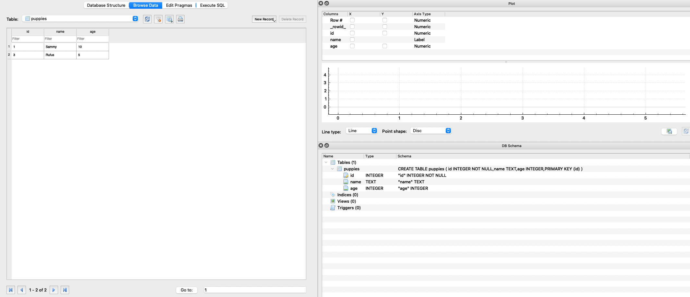
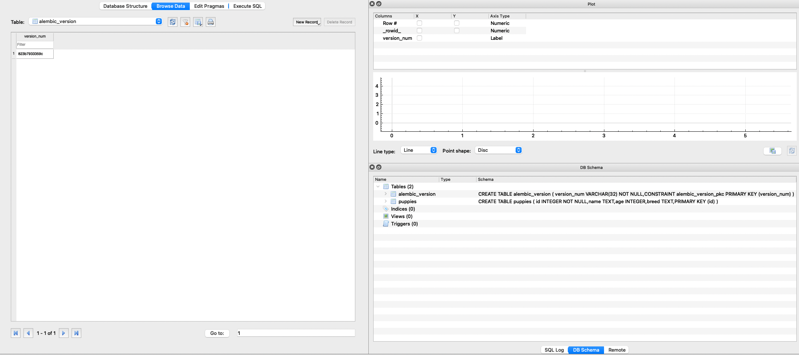
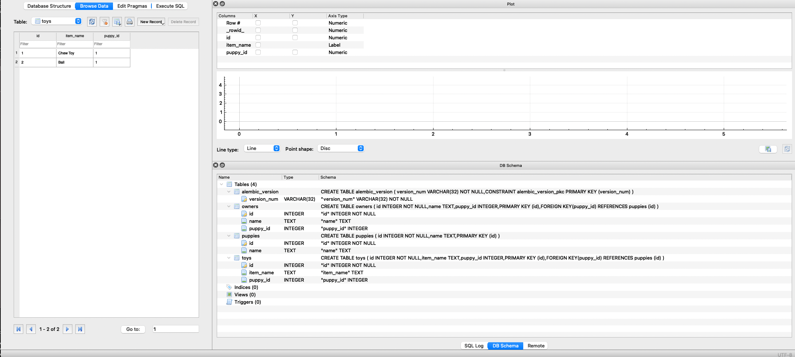

## 🦥 실습 코드 리뷰

## 00-Model-and-CRUD-Basics


```Python
# BasicCRUC.py
# CREATE - 새로운 Puppy 인스턴스를 생성하여 데이터베이스에 추가
my_puppy = Puppy('Rufus', 5)
db.session.add(my_puppy)  # 세션에 추가
db.session.commit()  # 변경사항을 데이터베이스에 커밋

# READ - 데이터베이스에서 데이터 조회
all_puppies = Puppy.query.all()  # 테이블의 모든 강아지 데이터 조회
print(all_puppies)

puppy_one = Puppy.query.get(1)  # id가 1인 강아지 조회
print(puppy_one)
print(puppy_one.age)

puppy_sam = Puppy.query.filter_by(name='Sammy').all()  # 이름이 'Sammy'인 강아지 리스트 조회
print(puppy_sam)

# UPDATE - 데이터 수정
first_puppy = Puppy.query.get(1)  # id가 1인 강아지 가져오기
first_puppy.age = 10  # 강아지의 나이 변경
db.session.add(first_puppy)  # 변경사항을 세션에 추가
db.session.commit()  # 변경사항을 데이터베이스에 커밋

# DELETE - 데이터 삭제
second_pup = Puppy.query.get(2)  # id가 2인 강아지 가져오기
db.session.delete(second_pup)  # 강아지 삭제
db.session.commit()  # 변경사항을 데이터베이스에 커밋

# 변경사항 확인
all_puppies = Puppy.query.all()  # 변경된 데이터베이스 내 모든 강아지 데이터 조회
print(all_puppies)

#이 코드는 SQLAlchemy ORM을 사용하여 데이터베이스를 조작하는 기본적인 CRUD(Create, Read, Update, Delete) 작업을 수행합니다. 주석을 제외한 코드만 실행해도 데이터베이스에서 강아지 데이터를 생성, 조회, 수정 및 삭제할 수 있습니다.
```

```python
# BasicModelApp.py
import os
from flask import Flask
from flask_sqlalchemy import SQLAlchemy

# 우리의 디렉토리 경로를 가져옵니다.
basedir = os.path.abspath(os.path.dirname(__file__))

app = Flask(__name__)
# Flask 앱을 데이터베이스에 연결합니다.
app.config['SQLALCHEMY_DATABASE_URI'] = 'sqlite:///' + os.path.join(basedir, 'data.sqlite')
app.config['SQLALCHEMY_TRACK_MODIFICATIONS'] = False

db = SQLAlchemy(app)

# 첫 번째 모델을 생성합니다!
# db.Model 클래스를 상속합니다.
class Puppy(db.Model):

    # 이 부분을 제공하지 않으면 기본 테이블 이름은 클래스 이름이 됩니다.
    __tablename__ = 'puppies'

    # 이제 열을 생성합니다.
    # 다양한 데이터 유형이 가능합니다. 이후 강좌에서 더 자세히 알아보겠습니다.
    # 자세한 문서: http://docs.sqlalchemy.org/en/latest/core/types.html

    # 기본 키 열, 각 개의 고유한 id
    id = db.Column(db.Integer, primary_key=True)
    # 강아지 이름
    name = db.Column(db.Text)
    # 강아지의 나이 (년 단위)
    age = db.Column(db.Integer)

    # 이 메서드는 이 테이블 내 인스턴스가 갖게 될 속성을 정의합니다.
    # id는 나중에 자동으로 생성되므로 여기에 추가하지 않습니다!
    def __init__(self, name, age):
        self.name = name
        self.age = age

    def __repr__(self):
        # 이것은 모델 내 강아지의 문자열 표현입니다.
        return f"Puppy {self.name} is {self.age} years old."
      
#이 코드는 SQLite 데이터베이스를 설정하고 Flask 앱과 연결한 후, SQLAlchemy를 사용하여 모델을 생성합니다. Puppy 클래스는 강아지 데이터의 테이블 구조를 정의하고, __init__ 메서드로 초기화하며, __repr__ 메서드로 해당 모델의 문자열 표현을 정의합니다. 이 코드는 데이터베이스와 모델 설정의 기본 개념을 보여줍니다.
```

```python
# SetUpDatabase
# 이것은 매우 간단한 스크립트로 DB 설정 방법을 보여줍니다.
# 나중에 템플릿과 함께 이 유형의 코드를 사용할 것입니다.

#####################################################
### 주의!! 이 스크립트를 여러 번 실행하면 ##########
### 데이터베이스에 여러 개의 강아지가 추가됩니다. ####
### 이것은 괜찮습니다. 추가 실행할 때마다 ############
### id 값만 1, 2보다 높게 생성될 것입니다. ########
#####################################################

# 데이터베이스 정보를 가져옵니다.
from BasicModelApp import db, Puppy

# 데이터베이스 내 테이블을 생성합니다.
# (보통 이렇게 하지 않습니다!)
db.create_all()

# 데이터베이스에 새로운 항목을 생성합니다.
sam = Puppy('Sammy', 3)
frank = Puppy('Frankie', 4)

# 아직 sam과 frank를 데이터베이스에 추가하지 않았으므로 id 값은 None이어야 합니다.
print(sam.id)
print(frank.id)

# 이 항목들을 데이터베이스에 추가하면 자동으로 id 값이 생성될 것입니다.
db.session.add_all([sam, frank])

# 아래와 같이 개별적으로 추가할 수도 있습니다.
# db.session.add(sam)
# db.session.add(frank)

# 이제 데이터베이스에 저장합니다.
db.session.commit()

# id 값을 확인합니다.
print(sam.id)
print(frank.id)
```

Data.sqlite



## 01-Flask-Migrate

```Python
# BasicModelApp.py
import os
from flask import Flask
from flask_sqlalchemy import SQLAlchemy
from flask_migrate import Migrate

# 현재 파일의 디렉터리를 기반으로 경로를 설정합니다.
basedir = os.path.abspath(os.path.dirname(__file__))

# Flask 앱을 생성합니다.
app = Flask(__name__)

# Flask 앱을 데이터베이스에 연결합니다.
app.config['SQLALCHEMY_DATABASE_URI'] = 'sqlite:///' + os.path.join(basedir, 'data.sqlite')
app.config['SQLALCHEMY_TRACK_MODIFICATIONS'] = False

# SQLAlchemy를 사용하여 데이터베이스와 연동합니다.
db = SQLAlchemy(app)

# 데이터베이스 마이그레이션을 위해 Migrate를 설정합니다.
Migrate(app, db)

# Puppy 모델을 정의합니다.
class Puppy(db.Model):

    # 테이블 이름을 정의합니다.
    __tablename__ = 'puppies'

    # 각 컬럼을 정의합니다.
    id = db.Column(db.Integer, primary_key=True)
    name = db.Column(db.Text)
    age = db.Column(db.Integer)
    breed = db.Column(db.Text)

    # 초기화 메서드를 정의합니다.
    def __init__(self, name, age, breed):
        self.name = name
        self.age = age
        self.breed = breed

    # 문자열 표현을 정의합니다.
    def __repr__(self):
        return f"Puppy {self.name} is {self.age} years old."
      
#이 코드는 Flask 앱을 생성하고 SQLAlchemy를 사용하여 SQLite 데이터베이스와 연결하는 과정을 보여줍니다. 또한 데이터베이스 마이그레이션을 위해 Flask-Migrate를 설정하고, Puppy 모델을 정의하고 있습니다. 
```

```
# 00_migrations_instructions
안녕하세요! 강의에서 보여진 명령어들은 주로 커맨드 라인에서 직접 실행됩니다. 이를 위해 명령어들을 간단한 텍스트 파일에 포스팅하여 참조할 수 있도록 하였습니다.

먼저 마이그레이션 디렉토리를 설정하기 위해 다음 명령어를 실행합니다:

bash

flask db init

!!!!!!!!!!!!!!!!!!!!!!!!!!!!!!!!!!!!!
!!!!!!!!! 중요한 참고 사항 !!!!!!!!!!!!
!!!!!!!!!!!!!!!!!!!!!!!!!!!!!!!!!!!!!

만약 다음과 같은 에러가 발생한다면:
Error: Could not locate Flask application.
You did not provide the FLASK_APP environment variable.

다음 코드를 실행하세요:

MacOS/Linux 사용자는 다음을 실행합니다:

bash

export FLASK_APP=BasicModelApp.py

Windows 사용자는 다음을 실행해야 합니다:

bash

set FLASK_APP=BasicModelApp.py
이렇게 함으로써 flask 명령 라인 도구가 어떤 Flask 앱을 참조하는지 이해할 수 있게 됩니다. 더 자세한 정보는 다음 링크에서 확인할 수 있습니다: http://flask.pocoo.org/docs/0.12/cli/

일반적으로 flask 앱은 현재 작업 중인 Flask 앱으로 설정되어야 합니다.
```

```
# 01_migration_examples
알겠습니다. 이제 더 현실적인 예시를 통해 마이그레이션 명령어의 기본을 배워보겠습니다. 먼저 모델 파일로 돌아가서 강아지의 품종(column)을 추가해보겠습니다.

모델 파일(.py)로 돌아가서 다음과 같이 강아지 품종(column)을 추가해주세요.

python

class Puppy(db.Model):

    # ... 다른 속성들 ...

    # 강아지 품종(column) 추가
    breed = db.Column(db.Text)
    
    def __init__(self, name, age, breed):
        # ... 다른 초기화 코드 ...
        self.breed = breed
그 다음, 마이그레이션 스크립트를 생성하여 변경 사항을 기록합니다. 아래 명령어를 통해 마이그레이션 스크립트를 생성합니다. 이때 변경 사항에 대한 설명을 -m 플래그와 함께 제공합니다.

bash

flask db migrate -m "added breed column"
마지막으로, 데이터베이스 변경을 적용하기 위해 다음 명령어로 업그레이드합니다.

bash

flask db upgrade
이제 강아지 모델에 품종(column)을 추가하고 해당 변경 사항을 데이터베이스에 반영하였습니다.
```

data.sqlite



## 02-Relationships

```python
# models.py
import os
from flask import Flask
from flask_sqlalchemy import SQLAlchemy
from flask_migrate import Migrate

######################################
#### SQLite 데이터베이스 설정하기 #####
####################################

# 현재 디렉터리 경로를 가져옴
basedir = os.path.abspath(os.path.dirname(__file__))

app = Flask(__name__)
# Flask 앱을 데이터베이스에 연결
app.config['SQLALCHEMY_DATABASE_URI'] = 'sqlite:///' + os.path.join(basedir, 'data.sqlite')
app.config['SQLALCHEMY_TRACK_MODIFICATIONS'] = False

db = SQLAlchemy(app)
Migrate(app, db)

#####################################
####################################
###################################

class Puppy(db.Model):

    __tablename__ = 'puppies'

    id = db.Column(db.Integer, primary_key=True)
    name = db.Column(db.Text)
    
    # 일대다 관계(One-to-Many)를 정의
    # 하나의 강아지는 여러 개의 장난감을 가질 수 있음
    toys = db.relationship('Toy', backref='puppy', lazy='dynamic')
    
    # 일대일 관계(One-to-One)를 정의
    # 하나의 강아지는 하나의 주인을 가짐
    # 강아지와 주인은 1:1 관계이므로 uselist은 False로 설정
    # 강한 가정: 하나의 강아지에는 하나의 주인, 그 반대도 성립
    owner = db.relationship('Owner', backref='puppy', uselist=False)

    def __init__(self, name):
        # 주의: 강아지는 이름만 가지고 초기화됩니다.
        self.name = name

    def __repr__(self):
        if self.owner:
            return f"강아지 이름은 {self.name}, 주인은 {self.owner.name}"
        else:
            return f"강아지 이름은 {self.name}, 아직 주인이 없습니다."

    def report_toys(self):
        print("여기 내 장난감들이야!")
        for toy in self.toys:
            print(toy.item_name)


class Toy(db.Model):

    __tablename__ = 'toys'

    id = db.Column(db.Integer, primary_key=True)
    item_name = db.Column(db.Text)
    # 해당 장난감을 소유한 강아지와 연결
    # 'puppies.id'를 사용하는 이유는 __tablename__='puppies'이기 때문
    puppy_id = db.Column(db.Integer, db.ForeignKey('puppies.id'))

    def __init__(self, item_name, puppy_id):
        self.item_name = item_name
        self.puppy_id = puppy_id


class Owner(db.Model):

    __tablename__ = 'owners'

    id = db.Column(db.Integer, primary_key=True)
    name = db.Column(db.Text)
    # 'puppies.id'를 사용하는 이유는 __tablename__='puppies'이기 때문
    puppy_id = db.Column(db.Integer, db.ForeignKey('puppies.id'))

    def __init__(self, name, puppy_id):
        self.name = name
        self.puppy_id = puppy_id
        
#위 코드는 강아지, 장난감, 주인 세 가지 모델 간의 관계를 정의하고 있습니다. 주석을 제외한 각 라인에 대한 설명을 위와 같이 제공해 드렸습니다.   
```

```python
# populate_database.py
from models import db, Puppy, Owner, Toy

# 강아지 2마리 생성
rufus = Puppy("Rufus")
fido = Puppy("Fido")

# 강아지들을 데이터베이스에 추가
db.session.add_all([rufus, fido])
db.session.commit()

# 쿼리로 확인하여 모든 강아지 출력
print(Puppy.query.all())

# 데이터베이스에서 Rufus를 가져옴
# 이름이 "Rufus"인 모든 강아지를 가져옴, 리스트를 반환하므로 인덱스 [0]
# 대신에 .all()[0] 대신에 .first()를 사용할 수도 있음
rufus = Puppy.query.filter_by(name='Rufus').first()

# Rufus에게 주인 생성
jose = Owner("Jose", rufus.id)

# Rufus에게 장난감 제공
toy1 = Toy('씹는 장난감', rufus.id)
toy2 = Toy("공", rufus.id)

# 이 변경 사항을 데이터베이스에 커밋
db.session.add_all([jose, toy1, toy2])
db.session.commit()

# 이제 추가한 내용이 반영된 Rufus를 다시 가져옴
rufus = Puppy.query.filter_by(name='Rufus').first()
print(rufus)

# 장난감 출력
print(rufus.report_toys())

# 데이터베이스에서 항목 삭제도 가능:
# find_pup = Puppy.query.get(1)
# db.session.delete(find_pup)
# db.session.commit()
```



## 03-Databases-in-Views

```

```

```

```

Datasqlite

## 04-Database-Project-Instructions

## 04-Project-Solutions


## 00-structure-example

## 01-Using-Blueprints


## 00-Password-Hashing

## 01-Flask-Login

## 02-Using-Flask-OAuth


## 01-Basic-Setup

## 02-Core-Views-and-Templates

## 03-Error-Pages

## 04-Models-Setup

## 05-Users-Forms

## 06-Users-Views-pt1

## 07-Users-Views-pt2

## 08-User-Blog-Posts-Template

## 09-Running-Site-Test

## 10-Blog-Posts-Forms

## 11-Blog-Posts-Views

## 12-Blog-Posts-Templates

## Final_Project


## 00-Simple-API

## 01-Basic-CRUD-API

## 02-REST-API-Authorization

## 03-REST-API-Database


## 00-Payments


내용

  본 후기는 정보통신산업진흥원(NIPA)에서 주관하는 <AI 서비스 완성! AI+웹개발 취업캠프 - 프론트엔드&백엔드> 과정 학습/프로젝트/과제 기록으로 작성 되었습니다. #정보통신산업진흥원 #NIPA #AI교육 #프로젝트 #유데미 #IT개발캠프 #개발자부트캠프 #프론트엔드 #백엔드 #AI웹개발취업캠프 #취업캠프 #개발취업캠프   
